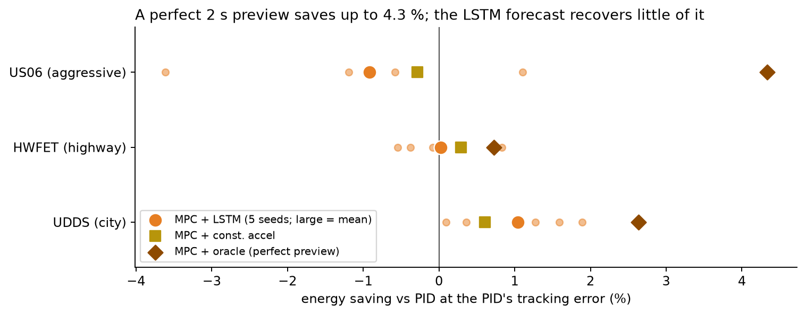
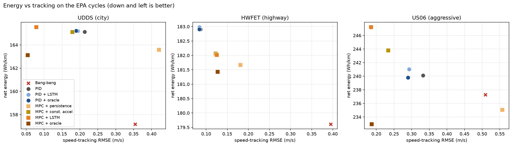
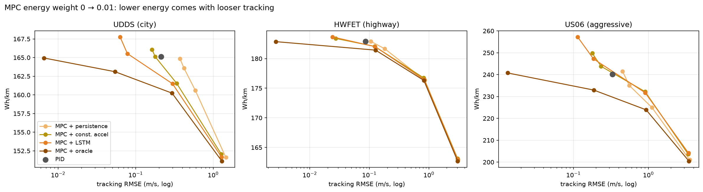

# Eco-PCC: AI-Based Ecological Predictive Cruise Control for Connected EVs

> Can an LSTM traffic-speed forecast make an EV's cruise control more energy-efficient? Evaluated on the EPA city,
> highway and aggressive drive cycles with a realistic drivetrain model.

**Riyan Wankhede (23BCE9287), Nishita (23BCE8235)**  
Department of Computer Science and Engineering, VIT-AP University

**Result:** a perfect 2-second preview of the traffic speed lets an MPC controller track as well as a PID while using
**2.6 % (city), 0.7 % (highway) and 4.3 % (aggressive) less energy**. A stacked LSTM forecaster recovers little of that:
over 5 training seeds, MPC + LSTM saves **1.0 % ± 0.8** on the city cycle, **0.0 % ± 0.6** on the highway and
**−0.9 % ± 1.7** on the aggressive cycle. Its forecasts are about as accurate as extrapolating the last second's
acceleration, and their step-to-step jitter makes the MPC accelerate and brake harder.



---

## Setup

An EV follows a reference speed, the traffic ahead. Every controller sees the current reference speed; the predictive
ones also get a 2 s forecast of it.

| Part | What it is |
| --- | --- |
| Test profiles | EPA **UDDS** (city, 1,369 s), **HWFET** (highway, 765 s) and **US06** (aggressive, 600 s) drive cycles, never used for training or tuning |
| Vehicle | 2,500 kg EV, 9:1 reduction gear, motor 400 Nm / 150 kW at 92 %, regen up to 200 Nm / 60 kW at 75 %, friction brakes for the rest |
| LSTM forecaster | stacked LSTM 128 → 64 (batch norm, dropout 0.2): last 10 s of reference speed → next 2 s; trained on 240 synthetic traffic episodes (urban, highway, aggressive), split by episode, early stopping on validation |
| Forecasts compared | **persistence** (speed stays the same: no forecast), **constant acceleration** (extrapolate the last second), **LSTM**, **oracle** (the true future: a perfect V2X preview) |
| Controllers | bang-bang; PID; PID + deceleration feedforward from the forecast; MPC over the forecast (2 s horizon, re-planned every 0.4 s, cost = tracking² + energy + smoothness) |
| Metrics | net battery energy per km (regen credited), speed-tracking RMSE, RMS jerk |

All controller gains and weights were set on synthetic profiles before any EPA run.

## Results

**Forecast accuracy**: RMSE of the 2 s forecast in m/s; LSTM over 5 seeds:

| Cycle | Persistence | Constant accel. | LSTM, mean ± sd |
| --- | --- | --- | --- |
| UDDS (city) | 0.729 | **0.292** | 0.320 ± 0.046 |
| HWFET (highway) | 0.352 | **0.133** | 0.177 ± 0.045 |
| US06 (aggressive) | 1.133 | 0.582 | **0.551 ± 0.034** |

**Energy at equal tracking.** A controller can always save energy by following the reference more loosely, so each MPC
is swept over its energy weight and interpolated to the PID's tracking error on the same cycle. Saving vs the PID
(positive = less energy):

| Cycle | MPC + persistence | MPC + const. accel. | MPC + LSTM (5 seeds) | MPC + oracle |
| --- | --- | --- | --- | --- |
| UDDS (city) | — | +0.6 % | +1.0 % ± 0.8 | **+2.6 %** |
| HWFET (highway) | — | +0.3 % | +0.0 % ± 0.6 | **+0.7 %** |
| US06 (aggressive) | — | −0.3 % | −0.9 % ± 1.7 | **+4.3 %** |

"—": without a forecast the MPC never tracks as tightly as the PID at any weight tried.

**All controllers at their default settings** (seed 42; energy in Wh/km, tracking RMSE in m/s, RMS jerk in m/s³):

| Controller | UDDS energy / RMSE / jerk | HWFET energy / RMSE / jerk | US06 energy / RMSE / jerk |
| --- | --- | --- | --- |
| Bang-bang | 157.2 / 0.354 / 15.9 | 179.6 / 0.395 / 12.6 | 237.3 / 0.509 / 15.1 |
| PID | 165.1 / 0.213 / 0.39 | 182.9 / 0.087 / 0.15 | 240.1 / 0.332 / 0.74 |
| PID + LSTM | 165.2 / 0.194 / 0.56 | 183.0 / 0.084 / 0.22 | 241.0 / 0.293 / 0.91 |
| PID + oracle | 165.2 / 0.189 / 0.47 | 182.9 / 0.084 / 0.18 | 239.8 / 0.290 / 0.78 |
| MPC + persistence | 163.6 / 0.421 / 1.71 | 181.7 / 0.181 / 0.46 | 235.0 / 0.557 / 1.78 |
| MPC + const. accel. | 165.1 / 0.179 / 1.80 | 182.1 / 0.123 / 0.60 | 243.8 / 0.234 / 2.47 |
| MPC + LSTM | 165.5 / 0.078 / 2.02 | 182.0 / 0.125 / 1.00 | 247.2 / 0.185 / 3.63 |
| MPC + oracle | 163.1 / 0.054 / 0.82 | 181.4 / 0.127 / 0.46 | 232.9 / 0.187 / 1.37 |



### What this shows

- **Preview information is worth a few percent, mostly in aggressive driving.** Over 2 s, highway speed barely changes,
  so even a perfect forecast saves only 0.7 % there.
- **The LSTM recovers little of it.** It halves persistence's forecast error, but a one-line constant-acceleration
  extrapolation is more accurate on the city and highway cycles and nearly as accurate on US06.
- **Forecast smoothness matters as much as accuracy.** The LSTM forecast changes from step to step and the MPC re-plans
  on each new one, so its RMS jerk is 2.5–2.8× the oracle MPC's (5-seed means), and the extra acceleration costs energy.
- **The deceleration feedforward in PID does not change energy** (≤ 0.4 %), even with a perfect forecast; it slightly
  tightens tracking.
- **Bang-bang uses 1–5 % less energy than PID, but tracks 1.5–4.5× worse with 20–80× the jerk.** It coasts inside its
  ±0.5 m/s band, and coasting is cheap. Energy figures need tracking and comfort next to them.



## Limitations

- The LSTM is trained on synthetic traffic only. Real traffic-speed data (V2X or probe vehicles) is the natural next
  step, as is smoothing the forecast or training with a smoothness penalty.
- Longitudinal vehicle model with constant motor and regen efficiencies and no road grade.
- The energy differences are small (a few percent), so they depend on the plant model; the comparisons hold the plant
  fixed and change only the controller or forecast.

---

## Repository structure

```
Eco-PCC/
├── Eco-Cruise_Control_for_EVs.ipynb   # Main notebook: simulator, drive cycles, LSTM, forecasts, all simulations (seed 42), ~15 min
├── multi_seed_evaluation.ipynb        # LSTM part repeated over 5 seeds (run the main notebook first), ~40 min
├── data/drive_cycles/                 # EPA UDDS, HWFET and US06 schedules (epa.gov)
├── results/                           # Figures and CSVs written by the notebooks
├── report/                            # IEEE-format paper, abstract and slides for this evaluation
├── reference/Zhou_et_al_2021_PACC.pdf # Base reference paper
├── requirements.txt
└── README.md
```

## Setup

```bash
git clone https://github.com/Riyann69/Eco-PCC.git
cd Eco-PCC
pip install -r requirements.txt
jupyter notebook Eco-Cruise_Control_for_EVs.ipynb
```

Run all cells top to bottom. LSTM training runs on the CPU and is deterministic for a given seed; the simulations run
in parallel on up to 8 cores.

## References

- Hochreiter, S. & Schmidhuber, J. (1997). Long Short-Term Memory. *Neural Computation*, 9(8), 1735–1780.
- Rawlings, J. B., Mayne, D. Q., & Diehl, M. (2017). *Model Predictive Control: Theory, Computation, and Design* (2nd ed.). Nob Hill Publishing.
- Vahidi, A. & Sciarretta, A. (2018). Energy saving potentials of connected and automated vehicles. *Transportation Research Part C*, 95, 822–843.
- U.S. EPA. Dynamometer Drive Schedules (UDDS, HWFET, US06). https://www.epa.gov/vehicle-and-fuel-emissions-testing/dynamometer-drive-schedules

## License

MIT
